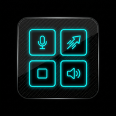
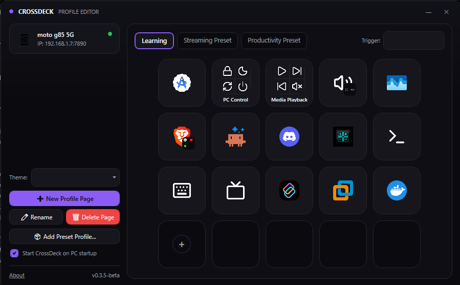
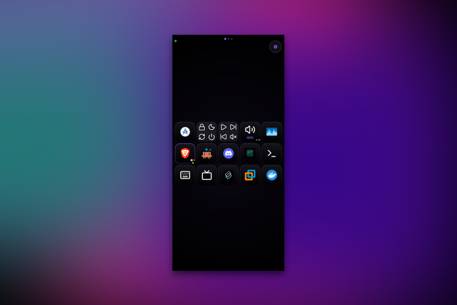

<div align="center">



# CrossDeck

### Your Android phone becomes a Stream-Deck for your Windows PC — over local WiFi, no cloud, no subscription.

[](https://github.com/ItisPhoenix/CrossDeck/releases/latest)
[](LICENSE)
[](#download)

Made by [ItisPhoenix](https://github.com/ItisPhoenix).

<p>
  <br/>
  Windows Host
</p>
<p>
  <br/>
  Android Client
</p>

[**Features**](#features) · [**How It Works**](#how-it-works) · [**Download**](#download) · [**Build It**](#building--windows-host) · [**FAQ**](#faq)

</div>

---

## Why CrossDeck?

A physical Stream Deck is $150+ hardware you have to buy, plug in, and find desk space for. CrossDeck turns the phone already in your pocket into the same thing: a grid of buttons that fires hotkeys, media controls, app launches, and volume/brightness dials on your PC — over your own WiFi, with nothing leaving your network.

It's fully open source, so every permission it asks for is auditable, not just promised.

## Repo Structure

```
/windows-host      .NET 8 / WPF tray app — runs on the PC being controlled
/android-client    Kotlin / Jetpack Compose app — runs on the phone (the "deck")
```

## Features

- **Windows Host**: WebSocket server + borderless WPF tray app + profile editor.
- **Android Client**: Full-screen Jetpack Compose grid, edge-to-edge, dark Obsidian theme.
- **Unified Design Language**: Both apps share the same **Obsidian Cyber-Intelligence** dark tech aesthetic — matching color palettes, typography, and interaction patterns across platforms.
- **Dynamic Accent Colors**: Choose from Neon Cyan, Neon Purple, Cyberpunk Yellow, Toxic Green, or Crimson Red. Color syncs live over WebSocket between both apps.
- **UDP Auto-Discovery**: Scan and connect instantly on the local network (saves last connection).
- **QR Pairing**: Scan a QR code in the Windows pairing window for instant connection.
- **Multi-Profile Management**: Create, rename, delete, and switch profiles from either the Android deck or the PC.
- **3D Profile Transitions**: Animated 3D flip card transition on the Android app whenever profiles are switched.
- **Bidirectional Grid Editor**: Edit actions, labels, folder layout, and grid positions on the fly from either client or host.
- **Folders**: Scoped button pages with nesting navigation hierarchy and back navigation.
- **First-Run Preset Picker**: Select Streaming, Productivity, or Blank preset on first launch.
- **Auto-Profile-Switch**: Windows Host watches the foreground process and switches profiles automatically.
- **Actions Engine**:
  - `hotkey` — Standard keyboard keystrokes via `SendInput`
  - `media_control` — Play, pause, skip, mute, volume up/down
  - `launch_app` — Launch programs/executables
  - `open_url` — Open URLs in default browser
  - `run_command` — Console shell command execution
  - `text_snippet` — Send raw text snippets via clipboard injection
  - `multi_action` — Sequenced combinations with custom delay intervals
  - `macro` — Record real keystrokes/clicks and replay them with original timing
  - `open_folder` — Navigate into sub-folder button pages
- **Dials / System Controls**: Tap a dial button to open a full-screen bottom-sheet touch-bar slider with haptic detent ticks to control:
  - System volume via WASAPI COM
  - Monitor brightness via DDC/CI (`dxva2.dll`) with WMI fallback for laptops
- **App Volume Mixer**: A dedicated dial mode opens a live bottom sheet listing every app currently playing audio, each with its own slider and mute toggle — no more picking one app in advance.
- **Haptic Feedback**: KEYBOARD_TAP, CONFIRM, and CLOCK_TICK haptics on the Android app for taps, connections, and slider steps.
- **Custom Tray Menu**: Dark-styled Windows system tray context menu matching the Obsidian UI theme.
- **Icon System**: 94-icon built-in pack (Lucide) or upload your own image, per button *and* per long-press action or individual chain step, synced over a token-authenticated asset server.
- **Resilient Reconnect**: Android auto-retries with backoff and shows the last-known deck (greyed out) behind a reconnect overlay instead of dropping straight to the pairing screen.
- **Revoke Device**: Kick the paired phone and issue a new PIN from the Windows tray menu.
- **Live State Buttons**: Buttons reflect real PC state, pushed live — Mute glows when actually muted, Play/Pause when actually playing, a `launch_app` button when its app is the focused window, and dial buttons show the live volume/brightness level.
- **Running Apps Switcher**: A live grid of every open PC window on the phone — tap to focus, long-press to close. Alt-Tab from your phone, including apps you never made a button for.
- **Macro Recorder**: Hit Record in the PC editor's multi-action panel, perform your keystrokes anywhere, hit Stop — the captured combos and timing become a button. Clicks back on the CrossDeck window itself are ignored, so returning to hit Stop doesn't add a stray step.
- **Multi-Action Popup**: Long-press (or tap, for a chain button) pops up every step as a real full-size button, each with its own editable label and icon — tap one to run just that step, not the whole chain. The closed-grid preview tiles the button into a mosaic of per-step glyphs instead of one busy icon.

## How It Works

```
┌─────────────────────────────┐         WiFi (LAN, router)         ┌──────────────────────────────┐
│   Android Client              │ <────────────────────────────────> │   Windows Host                 │
│  - Jetpack Compose grid UI    │   WebSocket, JSON, token auth       │  - WPF tray app (borderless)   │
│  - Profile editor              │   UDP broadcast discovery            │  - WS server (TcpListener)     │
│  - Bottom-sheet dials/mixer    │   or manual IP / QR pairing          │  - Action execution engine     │
└─────────────────────────────┘   HTTP /assets/ icon sync            │  - Profile store (JSON, auth)  │
                                                                       │  - Auto-profile watcher        │
                                                                       └──────────────────────────────┘
```

- **Pairing**: phone finds the PC via UDP auto-discovery, QR scan, or manual IP entry, then authenticates with a 6-digit PIN shown in the Windows tray menu.
- **Sync**: the PC holds the one authoritative profile (JSON on disk). Any edit, from either side, sends a `profile_edit` message over the WebSocket; the PC applies it, persists it, and broadcasts the updated `profile_sync` back to every connected client. Last-write-wins per button — no merge step needed for the current one-phone-per-PC scope.
- **Actions**: pressing a button sends its action id over the same socket; the Host's action engine runs it (`SendInput` for hotkeys/media, Win32 for launching apps/URLs, WASAPI/DDC-CI for volume/brightness, etc.) and pushes live state back so buttons reflect reality (mute glowing when actually muted, and so on).
- **Icons**: custom icons sync over a small token-authenticated HTTP endpoint on the Host rather than living in the profile JSON, keeping sync messages small.

---

## Download

| | |
|---|---|
| 🖥️ **Windows Host** | [**Download CrossDeckSetup.exe**](https://github.com/ItisPhoenix/CrossDeck/raw/main/windows-host/Setup/CrossDeckSetup.exe) |
| 📱 **Android Client** | [**Download CrossDeck Client.apk**](https://github.com/ItisPhoenix/CrossDeck/raw/main/android-client/Release/CrossDeck%20Client.apk) |

Both links download the file directly — no extra clicks. First-launch warnings are expected and covered in the [FAQ](#faq).

---

## Building — Windows Host

**Prerequisites**: Windows 10/11, .NET 8 SDK, Visual Studio 2022 with ".NET desktop development" workload.

```powershell
cd windows-host
dotnet restore
dotnet build
dotnet run --project CrossDeckHost
```

On first run: a tray icon appears. Right-click → **Show Pairing Info** to get the IP, port, and 6-digit PIN. Accept the Windows Firewall prompt — the phone cannot connect without it.

---

## Building — Android Client

**Prerequisites**: Android Studio (with bundled JDK 17), SDK Platform 31+, Android 12+ physical device on the same WiFi as the PC.

```bash
# From android-client/
./gradlew assembleDebug
```

Or open `android-client/` in Android Studio and run on your device.

1. Tap **Scan WiFi** to auto-discover your PC, or tap **Scan QR** to pair via QR code.
2. Enter PIN manually if preferred.
3. Once connected, the deck grid renders. Tap ⚙ to change the accent color theme.

---

## FAQ

**Windows shows "Unknown Publisher" when I run the installer — is that normal?**
Yes. There's no paid code-signing certificate behind this project. Click **More info → Run anyway**. The full source is in this repo if you want to verify what you're running before you do.

**Why can't I install the APK normally?**
It's not on the Play Store, so Android blocks it by default. Enable **Install unknown apps** for your browser/file manager under Settings → Apps, then open the downloaded file.

**Why does the Windows Host need `SendInput` / foreground-window access?**
`SendInput` simulates hotkeys and media keys — the same API any macro tool uses. Foreground-window polling only reads the active process *name* (never window content) to power auto-profile-switch, so the deck can flip profiles when you focus OBS, Chrome, etc.

**Why does the Android app need camera and local-network permissions?**
Camera is used only by the QR scanner during pairing — never afterward. Local network access is only to reach the Windows Host's WebSocket server on your LAN; CrossDeck makes no external network connections.

**My phone can't find my PC — what's wrong?**
Almost always the router. Both devices need to be on the **same WiFi**, with **AP Isolation / Client Isolation disabled** — that setting silently blocks device-to-device discovery on a lot of routers. Corporate and public WiFi typically block the mDNS/multicast traffic discovery relies on, so test on a home network first, or pair manually with the PC's IP.

**Can two phones control one PC, or one phone control two PCs?**
Not yet — v1 is one phone ↔ one PC. Re-pairing swaps which device is authorized.

---

## License

MIT — see [LICENSE](LICENSE).
